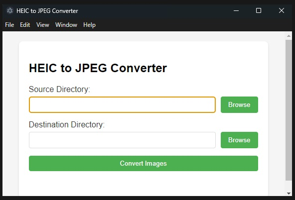

# HEIC to JPEG Converter

A simple desktop application to convert HEIC/HEIF images to JPEG format.



## Features

- User-friendly graphical interface
- Batch conversion of HEIC files to JPEG
- Progress bar to track conversion status
- Maintains original HEIC files while creating JPEG copies
- Simple directory selection with browse buttons

## Installation

### For Users
1. Download the latest release from the releases page
2. Run the installer
3. Launch the application from your Start Menu or Desktop shortcut

### For Developers
1. Clone this repository:
```bash
git clone [your-repo-url]
cd heic-convert
```

2. Install dependencies:
```bash
npm install
```

3. Run the application:
```bash
npm start
```

4. Build the executable:
```bash
npm run build
```

## Usage

1. Click "Browse" next to Source Directory to select the folder containing your HEIC images
2. Click "Browse" next to Destination Directory to select where you want the converted images to be saved
3. Click "Convert Images" to start the conversion process
4. Progress bar will show conversion status
5. Status message will display when conversion is complete

## Technologies Used

- Electron
- Node.js
- heic-convert library

## License

[Your chosen license]

## Credits

Based on the heic-convert library by [catdad-experiments](https://github.com/catdad-experiments/heic-convert)
